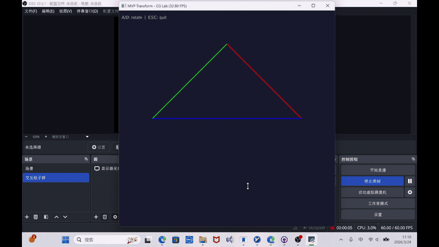
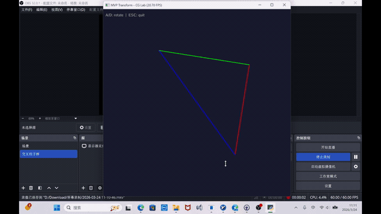

# Work2
本项目完成计算机图形学实验二
# CG-Lab2 · MVP 变换实验

## 项目框架

```
CG-Lab2/
├── src/
│   └── Work2/
│       ├── config.py       # 参数配置中心
│       ├── physics.py      # GPU 核心逻辑（MVP 矩阵推导）
│       ├── main.py         # 程序入口与视图层
│       ├── test.py         # 单元测试
│       └── __init__.py
└── README.md
```

`config.py` 集中管理所有超参数（窗口尺寸、相机位置、视场角、近远截面等），修改参数只需改这一个文件。`physics.py` 包含全部矩阵推导逻辑，以 `@ti.func` 装饰，运行在 Taichi 编译器管辖的 GPU/CPU 并行环境中。`main.py` 负责初始化 Taichi、驱动每帧渲染循环、响应键盘输入。

---

## 理论基础

三维场景渲染的核心问题是：如何把空间中的一个点映射到二维屏幕上。这个过程由三个依次作用的变换矩阵完成，合称 **MVP 变换**：

```
v_clip = M_proj · M_view · M_model · v_local
```

**齐次坐标**：为了把平移、旋转、缩放统一成矩阵乘法，三维坐标 `(x, y, z)` 被扩展为四维齐次坐标 `(x, y, z, 1)`，变换矩阵相应地扩展为 4×4。

### Model 变换

将物体从局部空间变换到世界空间。本实验实现绕 Z 轴旋转，旋转矩阵由二维旋转公式推广而来：

<table>
<tr><td align="center">cos θ</td><td align="center">-sin θ</td><td align="center">0</td><td align="center">0</td></tr>
<tr><td align="center">sin θ</td><td align="center"> cos θ</td><td align="center">0</td><td align="center">0</td></tr>
<tr><td align="center">0</td><td align="center">0</td><td align="center">1</td><td align="center">0</td></tr>
<tr><td align="center">0</td><td align="center">0</td><td align="center">0</td><td align="center">1</td></tr>
</table>

### View 变换

将世界坐标系变换到以相机为原点的观察空间。等价于把整个世界反向平移 `-eye_pos`：

<table>
<tr><td align="center">1</td><td align="center">0</td><td align="center">0</td><td align="center">-ex</td></tr>
<tr><td align="center">0</td><td align="center">1</td><td align="center">0</td><td align="center">-ey</td></tr>
<tr><td align="center">0</td><td align="center">0</td><td align="center">1</td><td align="center">-ez</td></tr>
<tr><td align="center">0</td><td align="center">0</td><td align="center">0</td><td align="center">1</td></tr>
</table>

### Projection 变换

将三维观察空间投影到二维裁剪空间，分两步完成：

**第一步：透视挤压矩阵** `M_persp→ortho`，将视锥棱台压缩为长方体。近平面不变，远平面的 XY 坐标被压缩到与近平面相同大小。第三行系数 A、B 由两个约束联立推导：近平面点 `z=n` 变换后不变，远平面点 `z=f` 变换后不变，解方程组得 `A = n+f`，`B = -nf`：

<table>
<tr><td align="center">n</td><td align="center">0</td><td align="center">0</td><td align="center">0</td></tr>
<tr><td align="center">0</td><td align="center">n</td><td align="center">0</td><td align="center">0</td></tr>
<tr><td align="center">0</td><td align="center">0</td><td align="center">n+f</td><td align="center">-nf</td></tr>
<tr><td align="center">0</td><td align="center">0</td><td align="center">1</td><td align="center">0</td></tr>
</table>

**第二步：正交投影矩阵** `M_ortho`，将长方体 `[l,r]×[b,t]×[f,n]` 线性映射到标准设备坐标系 `[-1,1]³`，先平移中心到原点，再缩放边长到 2：

<table>
<tr><td align="center">2/(r-l)</td><td align="center">0</td><td align="center">0</td><td align="center">-(r+l)/(r-l)</td></tr>
<tr><td align="center">0</td><td align="center">2/(t-b)</td><td align="center">0</td><td align="center">-(t+b)/(t-b)</td></tr>
<tr><td align="center">0</td><td align="center">0</td><td align="center">2/(n-f)</td><td align="center">-(n+f)/(n-f)</td></tr>
<tr><td align="center">0</td><td align="center">0</td><td align="center">0</td><td align="center">1</td></tr>
</table>

视锥体边界由视场角和近截面距离推导：

```
t = tan(fov/2) · |n|,  b = -t,  r = aspect · t,  l = -r
```

> 注意：相机朝向 -Z，因此 `n = -zNear`，`f = -zFar`。

最后经过**透视除法**，将齐次坐标 `(x, y, z, w)` 除以 `w`，得到 NDC 坐标，再线性映射到屏幕坐标 `[0,1]`。

---

## 代码逻辑

```
main() 每帧执行：
│
├── 键盘事件检测
│   ├── gui.is_pressed("a")  →  angle += ROTATE_STEP
│   ├── gui.is_pressed("d")  →  angle -= ROTATE_STEP
│   └── ESC                  →  退出
│
├── compute_mvp(angle, eye)          @ti.kernel
│   ├── get_model_matrix(angle)      →  绕 Z 轴旋转矩阵
│   ├── get_view_matrix(eye_pos)     →  相机平移到原点
│   ├── get_projection_matrix(...)   →  透视投影矩阵
│   ├── mvp = M_proj @ M_view @ M_model
│   └── transform_vertex × 3        →  写入 screen_verts field
│       ├── clip = mvp @ v
│       ├── 透视除法 ÷ w  →  NDC
│       └── NDC  →  屏幕坐标 [0, 1]
│
└── gui.line × 3 条边               →  绘制线框三角形
```

矩阵乘法顺序严格遵循右乘规则（列向量），变换从右向左依次执行：先 Model，再 View，最后 Projection。顶点数据直接在 `@ti.kernel` 内定义，避免 `ti.static` 访问 Python list 的兼容性问题。

---

## 实现功能

程序启动后弹出 700×700 的窗口，显示一个彩色线框三角形，三条边分别为红、绿、蓝三色。三角形初始顶点为 `(2,0,-2)`、`(0,2,-2)`、`(-2,0,-2)`，相机位于 `(0,0,5)` 朝向 -Z 方向。

| 按键 | 功能 |
|------|------|
| `A` | 绕 Z 轴逆时针旋转（每帧 2°） |
| `D` | 绕 Z 轴顺时针旋转（每帧 2°） |
| `ESC` | 退出程序 |

---

## 效果演示
<div align="center">
  
  
</div>
